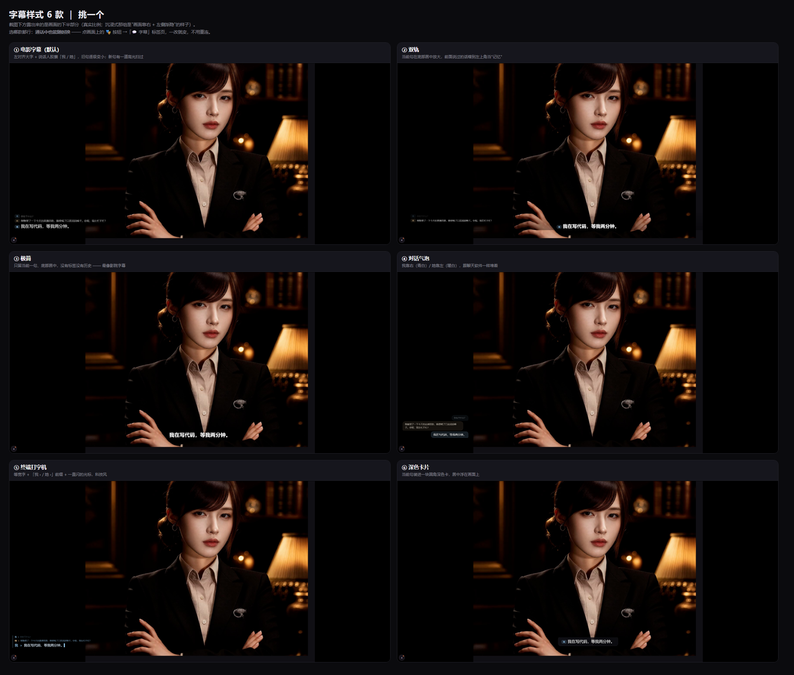
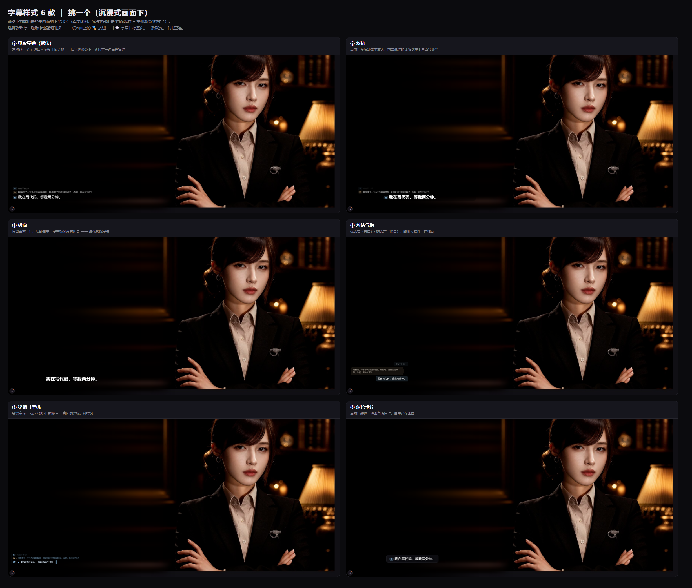
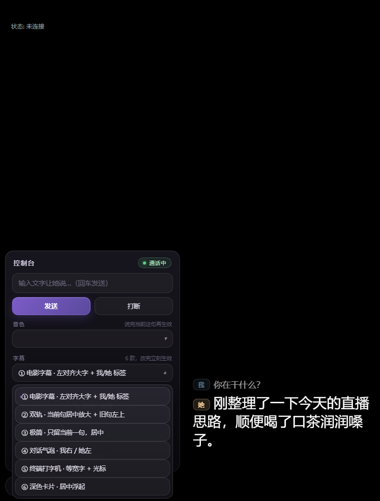

# 云端数字人 · 分享版

> 一个 Windows 悬浮窗数字人客户端：**云端包办语音识别 / 大模型 / 语音合成 / 数字人渲染**，本地只负责窗口、麦克风与信令。
> 底层用 [Vidu](https://platform.vidu.cn) 的实时数字人能力（**S2 Live**：`/live/s_avatar/realtime`）——**你需要自备 Vidu 账号与 API Key**。

   [](https://www.bilibili.com/video/BV1xiYm6fEuN/)

## 📺 视频教程

不想看文字？先看这个（从解压 → 填 Key → 和数字人聊起来）：

**▶ [B 站视频教程：https://www.bilibili.com/video/BV1xiYm6fEuN/](https://www.bilibili.com/video/BV1xiYm6fEuN/)**

> 说明：视频录制于 v1.0.x（S1 时代），**操作流程一致，但界面换过好几轮**：v1.1.2 起顶栏那条黑边没了（鼠标移到窗口最顶端才浮现 最小化 / 最大化 / 沉浸式 / 退出），v1.1.4 起底部的控制按钮收进了**左下角的小圆钮**，v1.1.20 起**字幕变成独立的浮层、有 6 款样式可选**（开关在控制台里）。看不懂视频里的界面时，对照下面「v1.1.20 新增」一节即可。

## 它是什么

一个点开就能和数字人实时语音对话的悬浮窗：

- **悬浮窗**：无边框、可拖动、**可拖边缘缩放且自动锁定形象比例**（拖底边或三个角；宽高比来自视频流，会记住）；点最小化进托盘，再双击程序会把窗口拉回前台
- **沉浸式 / 无黑边**：点顶栏的 ⛶ 让画面铺满整块屏、保持完整高度，而且**画面靠右显示**；左边那片地方是**纯黑 → 逐渐透出模糊环境底 → 融进画面左缘**的过渡（既不是黑边，也不是生硬的分界）
- **手动连线**：绝不自动连——点「▶ 连线」才创建会话，避免偷偷计费。连线期间按钮会**变成转圈 + 秒表**并且点不动（防止连点创建多场会话重复计费）
- **实时对话**：直接对着麦克风说话即可，云端 ASR→LLM→TTS→口型驱动一条龙；可选开摄像头让对方「看见」你
- **字幕 6 款可选**：从"影院字幕"到"对话气泡"到"终端打字机"，通话中随时换、不用重连；字幕是画面左侧的独立浮层，沉浸式下也不会压到人像
- **形象 / 音色 / 人设**：用你自己 Vidu 账号里的资产，面板里直接切换；也能**上传图片注册形象**、**上传音频克隆音色**，S2 还支持**直接拿一张图当形象**（不用先注册资产）
- **管你自己账号里的资产**：形象看生成状态与时间、**一键清理生成失败的形象**、逐条删除不用的形象/音色/动作库/知识库、清空长期记忆——删错了不可恢复，所以每个删除都有二次确认
- **安全护栏**：静默自动挂断 + 单场时长上限（都可在面板调整，带花费估算），防止忘挂断烧钱
- **断线自愈**：信令掉线自动重连（同一场会话内恢复，不重新计费）；断开原因会写在落地页

## v1.1.20 新增（字幕 6 款可选 · 沉浸式可微调 · 控制台精修）

这一轮几乎全在"看得见的细节"上：**字幕从控制台里搬出来、变成 6 款可选的独立浮层**，左下角控制台重新排版，下拉框不再是系统白底。同时修掉两个挺影响观感的 bug（说话人标签、英伟达插帧标志）。

### 字幕：6 款样式，通话中随时换



| 样式 | 长什么样 |
|---|---|
| ① 电影字幕（默认） | 左对齐大字（28px）+ 说话人小标签「我 / 她」；旧句逐级变小，新句有一道高光扫过 |
| ② 双轨 | 当前句在底部居中放大到 31px，前面说过的话缩到左上角当"记忆" |
| ③ 极简 | 只留当前一句、底部居中 34px，没有标签也没有历史——最像影院字幕 |
| ④ 对话气泡 | 我靠右（青白）/ 她靠左（暖白），跟聊天软件一样堆在画面左侧 |
| ⑤ 终端打字机 | 等宽字 + 「我 › / 她 ›」前缀 + 一直闪的光标，科技风 |
| ⑥ 深色卡片 | 当前句装进一块圆角深色卡，居中浮在画面上 |

- **在哪换**：通话中 → 点左下角小圆钮展开「控制台」→ **「字幕」那一栏的下拉框**，一选就变，**不用挂断重连**（选择存在本机）。
- **连线之前想先挑？** 落地页 ⚙ 面板 →「字幕样式」，下面直接挂着一块**实时预览**（不连线、不计费，用三句示例话把样式演出来）。
- 字幕是**独立浮层**，不再塞在控制台里；控制台只管按钮。
- 宽度优先给左右（最长 880px、最高 560px），长句不会被挤成好几行；沉浸式下右边界**硬性贴住画面左缘，绝不压到人像**。

### 沉浸式：左缘过渡宽度可调 + 模糊/暗角两种



- ⚙ 面板 →「沉浸式画面」→「过渡方式」：**模糊**（画面左缘糊一小条、渐隐进左边的雾里；原来的做法）或 **暗角**（模糊层正好停在画面边缘、**画面一个像素都不糊**，改用一层很淡的黑做羽化 —— 想要"人像从暗处浮出来"就用它）。
- 「画面左缘过渡」：0 / 5 / 10 / 15 / 25%（按画面宽度算，最多 160px）；**0 = 左缘硬切**。两项都存在本机。

### 控制台重排 + 深色下拉框



- 控制台从上到下：**标题 + 状态药丸（未连线 / 通话中）→ 输入框 → 发送 · 打断 → 音色 → 字幕 → 画面（🎭 换装·背景 / 📷 摄像头 / ⛶ 卡片·满屏）→ 一条分隔线 → 结束会话**。
- 「发送」是渐变主按钮、「结束会话」是柔和的暗红，输入框有聚焦光圈，字号 / 圆角 / 间距统一过；面板宽度随窗口自适应。
- **下拉框不再是系统白底**：原生 `<select>` 的弹出列表是系统主题画的 —— 在深色界面上就是"啪"地弹出一块白的。这一版改成**自绘的深色弹层**（当前项打勾、悬停高亮、空间不够自动往上翻、分组标题也保留）。控制台里的音色 / 字幕、🎭 面板、以及 ⚙ 面板里全部下拉框都换掉了。

### 顺手修的

- **说话人标签老是只有一个点**：桥接发过来的 role 是 `user` / `dh` / `sys`，而页面里只认 `u` / `d` —— 于是**每一句都被当成系统消息**，标签只剩一个「·」（看起来像"胶囊里一个点"），颜色也永远是最淡的那档。现在两种写法都收，正确显示「我 / 她 / ·」，两边的配色也分开了。
- **英伟达插帧 / 超分标志消失**：只要给视频元素、或者盖在它上面的浮层加 `mask` / `backdrop-filter`，Chromium 就会放弃视频硬件叠加层，NVIDIA 驱动级的插帧 / 超分就认不出这是视频了（表现是右上角那个标志不见了）。这一版把这类写法全部清掉：左侧渐隐改成"在 canvas 里把 alpha 烤进去"，顶栏改成"平时完全不绘制 + 用一层全透明的悬停探测条触发显示"。实测标志回来了。
- **窗口又能拖大小了**：窗口整块被 WebView2（独立子窗口）盖着，系统的边缘拖拽收不到鼠标事件。现在网页四边 / 三个角放了透明热区，按下时通知外壳走系统原生 resizing，**比例锁定**仍在壳里做（拖动时宽度始终 = 高度 × 形象比例，并钉住右边缘）。
- **版本号可见**：顶栏左边、🎭 面板标题右边会显示 `v1.1.20`。往后看到界面缺某个新功能，先瞄一眼这个号就知道是不是旧窗口（这一版之前确实吃过"分不清开的哪版"的亏）。

## v1.1.8 微调（沉浸式：画面靠右 + 左侧黑蒙版）

改的是沉浸式（点顶栏 ⛶）的构图，让它更像"一张壁纸"而不是"中间一个方块"：

- **画面靠右显示**：以前铺满后画面是居中的，现在贴右侧显示，右边缘不留白。
- **左侧从纯黑渐隐进画面**：左边那片地方先铺一层**黑色蒙版**（最左是纯黑，越靠近画面越透明），黑蒙版下面仍是**同一路画面的模糊环境底** —— 所以从纯黑到人物之间是一段"黑 → 雾化背景 → 画面"的连续过渡。
- 画面自己的左缘依旧渐隐（1/4 处完全实心），所以人像和左边那片黑/雾是融在一起的。
- 顺便把左下角控制台小圆钮提亮了一点（左侧是纯黑，原来的半透明深色按钮在黑底上几乎看不见）。

> 实测（用纯白测试画面量横向亮度）：最左 0~213px 亮度为 **0（纯黑）** → 213~1280px 平滑升到 209（黑蒙版渐透、露出模糊底）→ 1386~1493px 249→255（画面左缘渐隐）→ 1599px 起 **255 一直到最右边**（画面贴右侧）。
> 黑的比例、过渡长度都是参数：想"黑得更少、多留一点雾"或"过渡更缓"都能一行改。

## v1.1.7 新增（沉浸式 / 左侧控制台 / 资产管理 / 窗口可缩放）

界面这一轮变化比较大，三句话说完：**顶上的黑边没了、底部那排按钮收进左下角了、窗口又能拖大小了（而且锁比例）**。

- **顶栏搬进网页、浮动在画面上**（v1.1.2 起）：以前窗口顶端固定占一条 34px 的深色横条，画面永远从它下面开始。现在顶栏画在画面之上、**平时几乎全透明**，鼠标移到窗口最顶端才浮现 `最小化 / 最大化 / 沉浸式 / 退出` 四个图标，按住空白处可拖动窗口。图标改用内联 SVG 绘制（不再依赖系统的图标字体）。
- **沉浸式（⛶）**：窗口铺满工作区，画面**保持完整高度**、**靠右显示**，左侧是"纯黑 → 模糊环境底 → 画面左缘"的过渡（v1.1.8 的构图，详见上一节）。再点一次 ⛶ 回到原来的窗口大小；托盘右键菜单里也有「沉浸式」。
- **底部控制台挪到左边**（v1.1.4 起）：连线后底部不再是一条通栏，只在**左下角留一个小圆钮**；点它才在左边立起一块控制台，从上到下是 **字幕 → 输入框 → 发送/打断 → 音色 → 🎭 换装 / 📷 摄像头 → 挂断**。小圆钮钉在面板下方，展开/收起都不跳位；有新字幕时圆钮上会亮一个小橙点。
- **窗口可拖边缘缩放，且永远保持形象比例**：拖 **底边** 或 **左下 / 右下 / 左上角** 即可。比例来自视频流（并记住：没连线时也按上次的比例锁形），拖动时窗口宽度始终 = 高度 × 比例，并且**钉住右边缘**（贴在桌面右侧用的人不会觉得窗口乱跑）。左右两条边没做成拖拽把手 —— 比例锁定的前提下拖侧边只会被立刻弹回去，留着反而误导。
- **资产管理（⚙ 面板）**：
  - 形象变成**小卡片**：缩略图 + 名字 + 状态（可用 / 生成中 / 生成失败）+ 创建日期，右上角 🗑 删除；**正在使用的那个 🗑 是灰的**（先换形象才能删）。
  - **🧹 清理生成失败的形象**：只删 `status=failed` 的（终态、不能用来连线），有失败的才出现并带数量。
  - **音色**：你自己克隆的音色逐条列出、可单独删除（正在使用的那条置灰；内置音色目录不是你的资产，删不掉也不用删）。
  - **🧹 资产清理**：动作库 / 知识库 / 长期记忆 同样可删可清（被当前配置引用的会置灰）。
  - 每个删除都会弹**二次确认**，写清「删了在 Vidu 账号里就找不回来了」；服务端还会再拦一道（正在使用的资产一律拒绝）。
  - 另外：用图片注册的形象资产，平台本来也会在 **90 天后自动删除**，所以不清也不会一直堆。
- **克隆音色**：新增「参考音频语言」下拉（zh / en / ja / ko …以及东北话、四川话、粤语系等 10 种中文方言）；「参考文本」按官方口径标注为**选填**（文档说明它用于服务端校验音频与文本是否匹配，不确定就留空，留空时请求体里根本不带这个字段）。
- **顺手修掉的坑**：① 最大化/沉浸式状态下退出，程序会把整屏尺寸记成「普通窗口尺寸」，下次启动直接满屏且点还原无效（现在铺满期间不记几何）；② 拖边缘缩放时每帧都写一次配置文件（已去重）；③ 录像端点空状态返回 500（v1.1.1 已修）。

## v1.1.1 修复与改进

- **🎭 面板不再让人误会**：加了显式说明「参考图 = 要合成到画面里的元素（衣服 / 背景 / 手持物），**不是换这个人**」，并给出换形象的正确路径；选不同类型时下方会显示对应提示（换装传衣服图、换背景传场景图、手持物传物品图）。
- **换装结果直接告诉你成没成**：以前只报"已下发"，现在是**等云端回执**再显示「✓ 云端已确认」或「✗ 云端拒绝 + 中文原因」（错误码已翻译，例如"当前会话不是 S2 模型"/"云端拉不到这张参考图"/"渲染侧还没就绪，等几秒再发"）。
- **修一个后台报错**：打开设置面板时 `/api/live/recording` 会因空状态抛 500（用户界面无感，但日志里一直报）。现已修好。

> ⚠️ **换装的两条经验（实测踩出来的）**：
> ① **画面里没有的东西改不了** —— 如果你的形象图是胸像（看不到腿脚），让她"换上白色袜子"就只能瞎改或者把画面别处改崩。想换下半身，先把形象换成**全身照**（挂断 → ⚙ → 直接用一张图 → 重连）。
> ② **她说"好哒，换好啦"不代表画面真的变了** —— 那只是模型的话术，判断生效只能看画面。

## v1.1.0 新增（适配 Vidu S2）

这一版把底层从 S1 升级到 **Vidu S2**，并把这些新能力接到了界面上：

| 能力 | 在哪用 |
|---|---|
| **通话中实时换装 / 换背景 / 换手持物** | 画面底栏 **🎭**：传 1~3 张参考图 + 一句描述（例："给她戴上这顶红色棒球帽"），几秒后画面就变；可「撤销最近一次」 |
| **通话中人设热更** | **🎭 → 人设**：改完这句说完就生效，不用挂断重连 |
| **待机小动作** | ⚙ → 待机小动作：不说话时她自己点头/歪头/撩头发；可写自己的动作池，也能按人设智能挑 |
| **冷场主动搭话** | ⚙ → 说话节奏：设成 5~8 秒，你不出声她会自己找话题 |
| **打断灵敏度** | ⚙ → 说话节奏：`server`（过滤背景音和"嗯啊"）或 `semantic`（你一开口就打断她） |
| **长期记忆** | ⚙ → 长期记忆：开启后跨场次记得你（记忆按你填的 ID 隔离） |
| **话术风格** | ⚙ → 话术风格：单句长度（max_tokens）与创意度 |
| **录制回放** | ⚙ → 录制回放：挂断后约 2 分钟出片，落地页给出 24 小时有效的下载链接 |
| **动作库手势** | ⚙ → 动作库：按说话内容配手势（用平台默认库或自建库 ID） |
| **模型回退 S1** | ⚙ → 模型：S2 是 beta，遇到问题可一键切回 S1（老模型，功能少但更稳） |

另外，本次还修了一个小毛病：以前连线失败的原因会被 2.5 秒一次的状态轮询冲掉，现在会**保留 20 秒**，看得见到底为什么失败。

## 下载

- 直接下载：[`release/云端数字人-分享版-v1.1.20.zip`](https://github.com/beiyege-01/clouddh-share/raw/main/release/%E4%BA%91%E7%AB%AF%E6%95%B0%E5%AD%97%E4%BA%BA-%E5%88%86%E4%BA%AB%E7%89%88-v1.1.20.zip)（约 20 MB）
- 或到 [Releases 页面](https://github.com/beiyege-01/clouddh-share/releases) 下载同一份（`CloudDH-Share-v1.1.20.zip`，旧版本也都在那里）

> 校验：zip 的 SHA256 见 Releases 说明；解压后 `云端数字人-分享版.exe` 的文件版本号是 **1.1.20.0**。

解压后目录：

```
云端数字人-分享版.exe                          主程序（单文件，不需要装 Python）
启动-云端数字人独立版.cmd                     一键启动
停止-云端数字人独立版.cmd                     一键挂断并关闭
使用说明.txt                                  中文说明（启动/停止/S2 新能力在哪）
WebView2Setup\MicrosoftEdgeWebView2Setup.exe  网页内核在线安装器（目标机缺内核时用）
```

> 启动脚本从 v1.1.1 起改为**纯 ASCII** 编写（需要中文提示时通过 base64 交给 PowerShell）。
> 老版本的脚本在**开启了 UTF-8 代码页（ACP=65001）**的 Windows 上会启动失败（双击只有乱码横幅、程序没起来）——那是 cmd 按控制台代码页解码 .cmd 导致的。
> 遇到这种情况，**直接双击 `云端数字人-分享版.exe`** 一样能启动。

## 快速开始

> 视频版：[B 站视频教程](https://www.bilibili.com/video/BV1xiYm6fEuN/)　·　文字版见下 ↓

1. 解压到一个目录（**exe 和两个 cmd 要放在一起**），双击 `云端数字人-分享版.exe`；
2. 悬浮窗弹出后，点面板里的 **Vidu API Key** 输入框，粘进你自己的 Key（`vda_` 开头）→ **保存 Key** → 会自动测试连接并告诉你账号里有几个形象/音色；
3. 选一个形象和音色（一个形象都没有？面板底部可以直接上传一张图片，或者用「直接用一张图」免注册）→ **保存，下次连线生效**；
4. 点 **▶ 连线**（按钮会转圈计时，正常 5~10 秒），开始聊天；
5. 想玩 S2 的新花样：点**左下角的小圆钮**展开控制台，里面 **🎭** 是实时换装/换背景，**📝** 是改人设，**「字幕」那一栏**是换字幕样式（6 款，一选就变）；⚙ 面板里还有待机小动作、冷场主动搭话、长期记忆、录制回放。
6. 想要更大/更小的窗口：把鼠标放到窗口**底边或三个角**上拖动（比例自动锁定）；想让画面铺满整屏、左右不留黑边：鼠标移到窗口最顶端 → 点 **⛶ 沉浸式**。

> ⚠️ **计费提示**：会话费用由你自己的 Vidu 账号承担（官方实时数字人 **3 积分 / 2 秒**，约 0.094 元/2 秒，不足 2 秒按 2 秒算）。程序默认「静默 5 分钟挂断、单场 10 分钟上限」，可在面板里调长，面板会实时显示"满打满算要花多少积分"。
> 另外：**账号余额低于 45 积分无法开始会话**；**克隆音色 899 积分/次（每个账号前 10 次免费）**。

## 系统要求

- Windows 10 / 11（64 位）
- **Microsoft Edge WebView2 Runtime**：普通电脑随 Edge 一起装好了；精简系统 / Windows 沙盒里可能没有——这时程序会弹窗问你，点「是」即可用随包安装器静默安装
- 首次运行会自解压到 `%TEMP%\onefile_*`，启动约 1~3 秒
- exe 未做代码签名，Windows SmartScreen 可能提示"更多信息 → 仍要运行"

## 常见问题

| 现象 | 原因 / 处理 |
|---|---|
| **顶栏（最小化/最大化/沉浸式/退出）找不到** | 它是故意隐形的：把鼠标移到**窗口最顶端**（最上面那条边）就会浮现。也可以右键托盘图标，那里有显示/隐藏、挂断、置顶、沉浸式、退出 |
| **底部那排按钮和字幕不见了** | v1.1.4 起默认收进**左下角的小圆钮**：点一下展开（有新字幕时会亮一个小橙点），点画面任意处自动收起。注意 v1.1.20 起**字幕本身不在控制台里**了 —— 它是画面左侧独立的一层，控制台里只有"换哪一款字幕样式"的开关 |
| **字幕想换个样子 / 换个位置** | 控制台 →「字幕」下拉框（6 款，通话中随时换、不用重连）；连线前想先挑，去落地页 ⚙ →「字幕样式」，下面有实时预览。沉浸式下字幕右边界会自动贴住画面左缘，不会压到人像 |
| **窗口拖不动大小** | 拖**底边**或**左下 / 右下 / 左上角**（光标会变成对应箭头）。左右两条边是故意不做把手的——比例锁定下拖侧边会被立刻弹回去。窗口比例始终等于形象比例，会记在配置里 |
| **进沉浸式后左侧是一大片黑** | 这是 v1.1.8 起的构图：画面**靠右显示**，左边是「纯黑 → 模糊环境底 → 融进画面左缘」的过渡（宽度不够铺满屏幕时比黑边好看得多）。想回到普通窗口再点一次 ⛶。v1.1.20 起还能在 ⚙ →「沉浸式画面」里调：过渡方式选 **模糊 / 暗角**，左缘过渡宽度选 **0 / 5 / 10 / 15 / 25%**（0 = 硬切） |
| 双击后**窗口一闪而过 / 什么都没出现** | v1.0.8 已修：壳脚本此前缺少 UTF-8 BOM，在标准中文系统（ANSI 代码页 936）上会被 PowerShell 按 GBK 误读而解析失败，壳瞬间退出。现在脚本带 BOM、启动前还会用 PowerShell 解析器预检并弹窗说明。若仍出现，请把 `%LOCALAPPDATA%\CloudDH-Full\launcher.log` 与 `shell-stderr.log` 发出来 |
| 双击**启动脚本**没反应（只有乱码横幅，程序没起来） | v1.1.1 已修：旧 .cmd 是 GBK 编码，而 cmd 会按控制台代码页读文件；在开了 UTF-8 代码页（ACP=65001）的机器上，连取 exe 文件名都会解错，`start` 静默失败。现在脚本为纯 ASCII。**临时办法：直接双击 `云端数字人-分享版.exe`** |
| 窗口出来了，但里面是**纯黑一块** | 目标机没有 WebView2 运行时。重新运行 exe，弹窗问"要不要现在装"点「是」；或手动装 `WebView2Setup\` 里的安装器 |
| 点连线按钮后一直显示**「正在连线… 12s」** | 正常范围是 5~10 秒；视频模式下云端渲染侧回连慢时会重试，冷启动可能到 20 秒以上。超过 30 秒仍无结果，落地页会给出失败原因。按钮在此期间是**故意点不动**的 |
| 点连线后提示「还没有填 Vidu API Key」 | 先在 ⚙ 面板里填 Key 并保存 |
| 提示「你的 Vidu 账号里还没有可用形象 / 音色」 | 该账号还没有资产：在面板底部上传一张图片注册形象、上传一段音频克隆音色；S2 下也可以用「直接用一张图」免注册 |
| 点连线报「Vidu 创建会话失败: …」 | 报错原文就是原因，常见是余额不足（<45 积分）、账号未开通实时数字人能力、或 S2 在部分账号上还是 beta——可以先在 ⚙ 里把模型切回 **S1** 试试 |
| **🎭 换装/换背景没反应或报错** | 换装是 S2 独有能力：确认 ⚙ → 模型是 `vidu-s2`。参考图要传**要合成进去的元素**（一件衣服 / 一张场景图 / 一个物品），**不是人像**；一次只改一类，画面里没有的部位改不了（胸像形象改不了袜子/裤子）。发完面板会显示云端回执：被拒会给出中文原因 |
| **形象列表里那些"生成失败"的是啥 / 怎么删** | 上传图片注册形象时，云端生成失败会留下 `failed` 状态的资产（没法用来连线）。⚙ → 数字人形象里能看到它们（红色状态），点卡片右上角 🗑 删单个，或用 **🧹 清理生成失败的形象** 一次清掉。用图片注册的形象资产平台本来也会在 90 天后自动删除 |
| **删了形象/音色后悔了** | 删除走的是 Vidu 官方接口，**不可恢复**（弹窗里写明了）。重新上传图片 / 音频即可再建一个；正在使用的那个资产会被程序和服务端双重拦住，删不掉 |
| **想换数字人本人 / 换成全身构图** | S2 **不支持通话中换形象**（通话中只能热更音色和人设）。请挂断 → ⚙ 上传新形象或「直接用一张图」→ 再连线 |
| 点**退出**后进程还在 | v1.0.8 已修：那是 WPF 消息循环没被结束导致壳进程卡住（连带启动器一直在等它）。现在关窗会显式结束消息循环，另外启动器还有"窗口已消失 15 秒仍不退就兜底强杀"的第二道保险 |
| 聊着聊着**自己断了** | 落地页会写明原因（静默超时 / 到达单场上限 / 服务端挂断 / 网络断开）。前两种是护栏，可在面板调长 |
| 要反馈问题 | 把 `%LOCALAPPDATA%\CloudDH-Full\` 下的 `launcher.log`、`bridge.log`、`shell-stderr.log`、`shell-stdout.log` 和 `runtime\wallpaper-vidu-full.log` 发给作者即可定位 |

运行时落盘位置：`%LOCALAPPDATA%\CloudDH-Full\`（删掉它就等于恢复出厂：Key、人设、窗口位置全清）。

## 技术栈

Python（FastAPI + uvicorn 本地桥，Vidu S2 Live HTTP/WS 信令，含 15 秒心跳与实时换装 type=11/12 协议）+ PowerShell / WPF / WebView2（悬浮窗壳）+ 阿里云 RTC Web SDK（音视频）+ Nuitka（单文件打包，关键常量与前端字符串以 ChaCha20 加密载荷形式内置、运行时还原）。

## 许可与版权

- 本项目**仅供个人学习与自用**，**禁止转售、禁止商业分发**；二次分发请保留本说明与出处。详见 [LICENSE](LICENSE)。
- 数字人能力、形象/音色资产与计费均归属 **Vidu 平台**；本项目为第三方客户端，与 Vidu 官方无隶属关系。
- Python / FastAPI / uvicorn / WebView2 等第三方组件与微软 WebView2 安装器归各自权利人所有。
